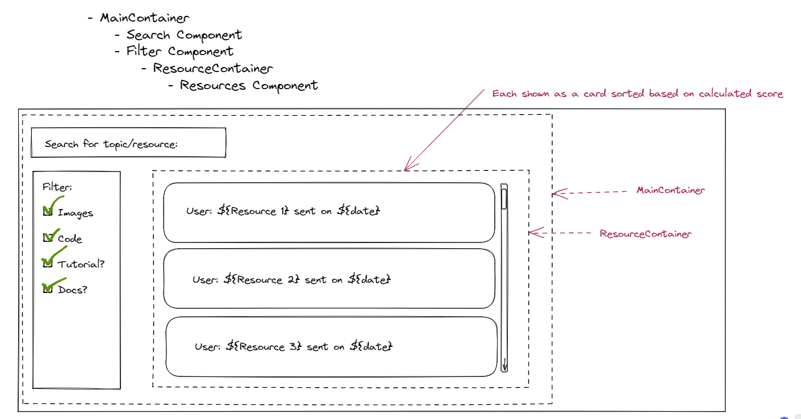

# granitify
## developers
- Chase
- Jackie
- Rosendo
- Samson
- Chris

## setup
```
git clone https://github.com/granitify/granitify.git
cd granitify
npm install
touch secrets.json
```

In the `secrets.json` file:
```
{
	"MONGO_URI": "mongodb+srv://<yourusername>:<yourpassword>@<yourdatabaseaddress>/?retryWrites=true&w=majority"
}
```

In one terminal, start the back end:
`npm start`

In another terminal, start the webpack-dev-server for the front end
`npm run dev`


```
messageObject { ID: id#, INT
                 Text: '', STRING
                 User: "author", STRING
                 Date: timestamp, DATE
                 Attachments: undefined, ???
                 Score: reactions + pinned etc., INT
                 Embed: embed, ???
                 Subject: undefined(react, mongodb etc..), STRING
                 Category: undefined(tutorial, docs, lecture) STRING
                 Resource: {URL: [''] ,  IMAGE: ''   CODE: ''}
 }
 ```

## Message object spec
```
messageObject {
  ID: INT (id of Discord message object) required, must be unique
  User: STRING (usernamne of sender of message) required
  Date: INT (time in seconds elapsed since epoch) required
  Attachments: ARRAY (array of attachmentObjects), optional, defaults to an empty array
  Score: INT (calculated score of resource), required, defaults to 0,
  Text: STRING (full text of body of message), optional, defaults to empty string
  Embed: ARRAY (array of embedObjects), optional, defaults to empty array
  Subject: STRING (describes subject matter of resource, e.g. React or Data Structures), optional, defaults to empty string
  Category: STRING (describes general category of resource, e.g. tutorial or documentation), optional, defaults to empty string
  Resource: OBJECT (keyed object containing parsed out resources)
    {
     URL: ARRAY (array of strings representing hyperlinks found in message), defaults to empty array
     IMAGE: ARRAY (array of strings representing image URLs found in message), defaults to empty array
     CODE: ARRAY (array of strings representing code snippets found in message), defaults to empty array
    }
}
 ```
See `./sample-objects.json` for an importable array of sample objects based on the spec


## React Structure

```
<App // Does nothing
  < MainContainer // Contains filter/search state and functions, calls sub-components/containers
	State:
		subjects: [str...]
		categories: [str...]
		filterSubjects: [ str...]
		filterCategories: [ str...]
		currentSearch: str
	Functions
		setSubjectFilters: func
		setCategoryFilters: func
		setSearch: func
		getCategories: func
		getSubjects: func

	Return:
		<SearchMenu props -> currentSearch, setSearch

		<FilterMenu props -> subjects, categories, filterSubjects, filterCategores, setSubjectFilters, setCategoryFilters

		<ResourceContainer props -> filterSubjects, filterCategories, currentSearch
			State:
				resourceList: [ {resourceObj}...]
			Functions:
				filterResources: func
				searchResources: func


			resourcesToDisplay:
				A list of <ResourceDisplay > components, each being propdrilled one of the resources
					left after filtering and searching the resourceList
			Return:

				resourcesToDisplay: [<ResourceDisplay>...] props-> One resource from ResourceList per ResourceDisplay


```

### Page Mockup

